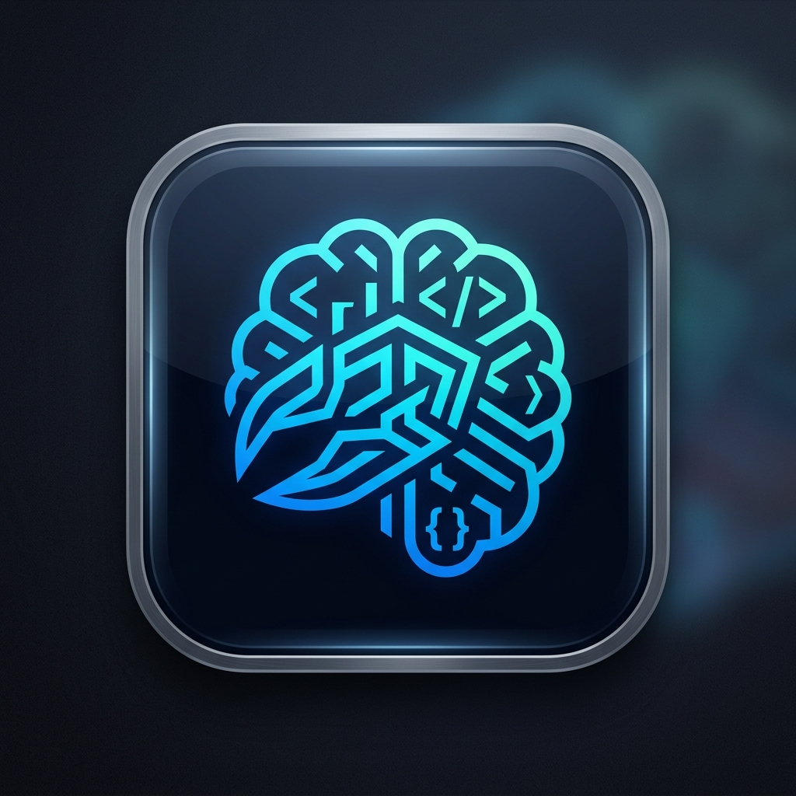

<p align="center">
  
</p>

<h1 align="center">LocalMindDesk</h1>

<p align="center">
  <strong>🧠 本地 AI 桌面助手 — 不只是聊天，还能操作你的电脑</strong><br>
  <em>Your mind, locally amplified.</em>
</p>

<p align="center">
  <a href="doc/RUN_GUIDE.md">🚀 快速启动</a> ·
  <a href="doc/project_architecture_guide.md">🏗️ 架构指南</a> ·
  <a href="doc/action_agent_architecture.md">⚙️ Action Agent</a> ·
  <a href="doc/self_evolution_architecture.md">🧬 自进化架构</a>
</p>

<p align="center">
  
  
  
  
</p>

---

## ✨ 特性

### 🔒 完全本地化
连接 [LM Studio](https://lmstudio.ai) 或任何 OpenAI 兼容 API，所有数据留在你的电脑，隐私绝对安全。

### 🎯 操作执行 (Action Agent)
不只是对话——AI 可以直接操作你的电脑：
- 📁 **文件操作** — 创建、读取、移动、删除文件
- 💻 **命令执行** — 运行终端命令、安装软件
- 📸 **截屏识别** — 捕获屏幕并分析内容
- 🔍 **代码搜索** — grep/find 搜索项目代码
- 📊 **文档生成** — 自动生成 PPT、Word 文档
- 🌐 **联网搜索** — 实时信息检索
- 🛡️ **三级安全拦截** — safe / moderate / critical 分级确认，危险操作需手动批准

### 🧠 多层记忆系统
| 层级 | 类型 | 说明 |
|------|------|------|
| L1 | 会话记忆 | 当前对话上下文，自动压缩 |
| L2 | 事实记忆 | 从对话中自动提取用户事实（名字、偏好、习惯等） |
| L3 | 向量记忆 | TF-IDF + 可选 Embedding 的长期语义检索 |

### 💬 三种交互方式
- **CLI 终端** — 最轻量，不需要后端，直接 `python cli.py`
- **网页版** — 完整功能，浏览器打开 `localhost:8000`
- **Electron App** — 无边框桌面应用，自动管理后端生命周期

### 🎭 多角色系统
5 层蒸馏 Persona 架构，支持从聊天记录 / 描述一键生成角色，角色间可自由切换。

### 🤖 自进化
AI 根据你的使用反馈自动调整行为、风格和记忆，越用越懂你。

### 📱 微信桥接
通过腾讯官方 iLink Bot API 连接微信。扫码登录后，可随时随地通过微信远程对话。

### 🐾 桌宠模式
可爱的像素风桌面宠物，支持自定义 Spritesheet，AI 状态实时同步到宠物表情（实验性功能）。

---

## 📸 截图

> *启动后访问 `http://localhost:8000` 即可看到界面*

---

## 🚀 快速开始

### 前置要求

| 依赖 | 版本 | 用途 |
|------|------|------|
| **Python** | 3.10+ | 后端 API |
| **Node.js** | 18+ | Electron App（可选） |
| **LM Studio** | 最新版 | 本地模型推理 |

### 安装

```bash
# 1. Clone 项目
git clone https://github.com/your-username/localminddesk.git
cd localminddesk

# 2. 安装 Python 依赖
pip install -r requirements.txt

# 3. 安装 Node 依赖（Electron 桌面版需要）
npm install

# 4. 配置模型
# 编辑 config.json，将 "your-model-name-here" 改为你在 LM Studio 中加载的模型名称
```

### 运行

```bash
# 方式一：CLI 对话（最轻量，不需要启动后端）
python cli.py

# 方式二：网页版（完整功能）
python -m uvicorn app.main:app --host 0.0.0.0 --port 8000
# 然后浏览器打开 http://localhost:8000

# 方式三：Electron 桌面 App（自动启动后端）
npm run dev

# 方式四：一键启动菜单
# Windows 用户直接双击 start.bat
```

> 详细运行指南请参考 [doc/RUN_GUIDE.md](doc/RUN_GUIDE.md)

### CLI 启动参数

```bash
python cli.py                      # 默认聊天模式
python cli.py -p <角色slug>        # 指定角色启动
python cli.py --mode plan          # 规划模式（AI 先分析再行动）
python cli.py --no-color           # 无颜色输出（适合日志/管道）
```

### CLI 内置命令

进入对话后，输入以下命令可控制会话：

| 命令 | 说明 |
|------|------|
| `/help` | 显示帮助 |
| `/persona` | 列出所有可用角色 |
| `/persona <slug>` | 切换到指定角色 |
| `/mode` | 查看当前对话模式 |
| `/mode chat` | 切换到聊天模式 |
| `/mode plan` | 切换到规划模式 |
| `/mode execute` | 切换到执行模式 |
| `/mode review` | 切换到审查模式 |
| `/clear` | 清空对话历史 |
| `/memory` | 查看长期记忆 |
| `/status` | 查看模型/角色/历史状态 |
| `exit` / `q` | 退出 |

---

## 📂 项目结构

```
localminddesk/
├── app/                 ← 🧠 Python 后端核心
│   ├── main.py          ← FastAPI 主入口
│   ├── action_planner.py← 操作意图解析
│   ├── action_engine.py ← 操作安全执行 + 三级沙盒
│   ├── thinking_engine.py ← 批判性思维引擎
│   ├── soul_manager.py  ← 多角色管理 + 5 层蒸馏
│   ├── wechat_bridge.py ← 微信 iLink 桥接
│   ├── vector_memory.py ← TF-IDF 向量记忆
│   ├── fact_memory.py   ← 用户事实自动提取
│   ├── privacy_filter.py← 隐私信息过滤
│   ├── tools/           ← 工具集（文件/命令/截图/搜索/浏览器等）
│   ├── router/          ← 多路由意图分发
│   └── integrations/    ← 外部应用集成框架
├── frontend/            ← 🎨 前端界面 (HTML/CSS/JS)
│   ├── js/              ← 模块化前端（chat, wechat, workspace...）
│   └── assets/pets/     ← 桌宠素材
├── electron/            ← 🖥️ Electron 桌面壳
│   ├── main.js          ← 无边框窗口 + 桌宠窗口
│   ├── python-bridge.js ← Python 后端自动启停
│   └── preload.js       ← 安全 IPC 桥接
├── data/                ← 💾 运行时数据（gitignore）
├── doc/                 ← 📝 项目文档
├── config.json          ← ⚙️ 模型配置
├── agents.json          ← 🤖 Agent 提示词配置
└── cli.py               ← 💻 CLI 入口
```

---

## ⚙️ 配置

编辑 `config.json` 来配置你的模型：

```json
{
  "active_model": "local-lmstudio",
  "temperature": 0.7,
  "max_tokens": 131072,
  "server_port": 8000,
  "models": [
    {
      "name": "local-lmstudio",
      "provider": "lmstudio",
      "base_url": "http://127.0.0.1:1234/v1",
      "api_key": "not-needed",
      "model": "your-model-name-here",
      "is_active": true
    }
  ]
}
```

也支持配置多个模型端点，包括云端 API（任何 OpenAI 兼容接口）。

---

## 🏗️ 架构概览

```
用户界面 (HTML/Electron/CLI)
    ↕ HTTP/WebSocket (localhost:8000)
FastAPI 后端 (app/main.py)
    ├── 意图路由 (router/ — chat/action/tool/config/schedule)
    ├── 操作系统 (action_planner → action_engine → tools/)
    ├── 记忆系统 (memory + vector_memory + fact_memory)
    ├── 角色系统 (soul_manager + distill_engine)
    ├── 思维引擎 (thinking_engine)
    ├── 隐私保护 (privacy_filter + model_router)
    ├── 定时任务 (scheduler)
    └── 微信桥接 (wechat_bridge → ilink_client)
         ↕
本地 AI 模型 (LM Studio / OpenAI API)
```

> 详细架构文档：[doc/project_architecture_guide.md](doc/project_architecture_guide.md)

---

## 🤝 微信连接

LocalMindDesk 支持通过腾讯官方 iLink Bot API 连接微信。扫码登录后，你可以通过微信远程与 AI 助手对话。

**连接步骤：**
1. 启动网页版后端
2. 在界面中点击「微信」标签页
3. 扫描二维码完成绑定
4. 通过微信发消息给 Bot 即可

**支持功能：**
- 文本消息收发
- 远程命令执行
- 主动提醒推送（定时任务触发）
- 消息自动分段（超长回复自动拆分）

---

## 🗺️ Roadmap

### 🔌 MCP 协议支持（计划中）

[Model Context Protocol (MCP)](https://modelcontextprotocol.io/) 是 Anthropic 提出的 AI 工具调用标准协议。LocalMindDesk 计划支持 MCP，届时将可以：

- **作为 MCP Host** — 连接任何标准 MCP Server（数据库、API、文件系统等），让 AI 直接使用海量第三方工具
- **作为 MCP Server** — 将 LocalMindDesk 的记忆系统、角色管理、操作执行等能力暴露为标准 MCP 接口，供其他 AI 应用调用
- **工具生态扩展** — 无需开发，直接接入社区已有的 MCP Server（GitHub、Slack、Google Drive 等）

> 🎯 MCP 将使 LocalMindDesk 从"单机 AI 助手"进化为"可连接一切的 AI 中枢"。

---

### 🔗 应用集成框架（计划中）

LocalMindDesk 计划实现一个通用的**外部应用集成框架**，让 AI 能够直接操控第三方应用：

- **集成管理器** — 统一注册、检测、配置外部应用（微信、邮件、日历等）
- **插件式架构** — 每个集成实现标准接口（`auto_detect` / `get_tools` / `install_commands`），开发者可快速扩展
- **AI 工具注入** — 集成的工具自动注册到 Action Agent 的工具表，AI 可以直接调用
- **安全控制** — 集成操作遵循三级安全拦截机制，敏感操作需用户确认

**目前已实现的集成：**
| 集成 | 状态 | 说明 |
|------|------|------|
| 微信 (WeChat) | ✅ 已实现 | iLink Bot API，扫码登录，消息收发 |

**计划中的集成：**
| 集成 | 说明 |
|------|------|
| 📧 邮件 (SMTP/IMAP) | AI 读取和发送邮件 |
| 📅 日历 (CalDAV) | AI 管理日程、创建提醒 |
| 📝 Notion | AI 读写 Notion 页面和数据库 |
| 🎵 Spotify | AI 控制音乐播放 |
| 🏠 智能家居 (HomeAssistant) | AI 控制家居设备 |

> 🎯 应用集成将使 LocalMindDesk 成为你的 **数字生活中枢**，一个入口操控所有应用。

---

## 📖 文档

| 文档 | 说明 |
|------|------|
| [RUN_GUIDE.md](doc/RUN_GUIDE.md) | 完整运行指南（CLI / 网页 / Electron） |
| [project_architecture_guide.md](doc/project_architecture_guide.md) | 保姆级架构讲解 |
| [action_agent_architecture.md](doc/action_agent_architecture.md) | Action Agent 设计文档 |
| [self_evolution_architecture.md](doc/self_evolution_architecture.md) | 自进化架构设计 |
| [COMMANDS.md](COMMANDS.md) | 命令速查手册 |

---

## 🤝 Contributing

欢迎提交 Issue 和 Pull Request！

1. Fork 本仓库
2. 创建特性分支 (`git checkout -b feature/amazing-feature`)
3. 提交你的修改 (`git commit -m 'Add amazing feature'`)
4. 推送到分支 (`git push origin feature/amazing-feature`)
5. 提交 Pull Request

---

## 📜 License

[MIT](LICENSE)

---

<p align="center">
  Made with ❤️ by LocalMindDesk Team
</p>
