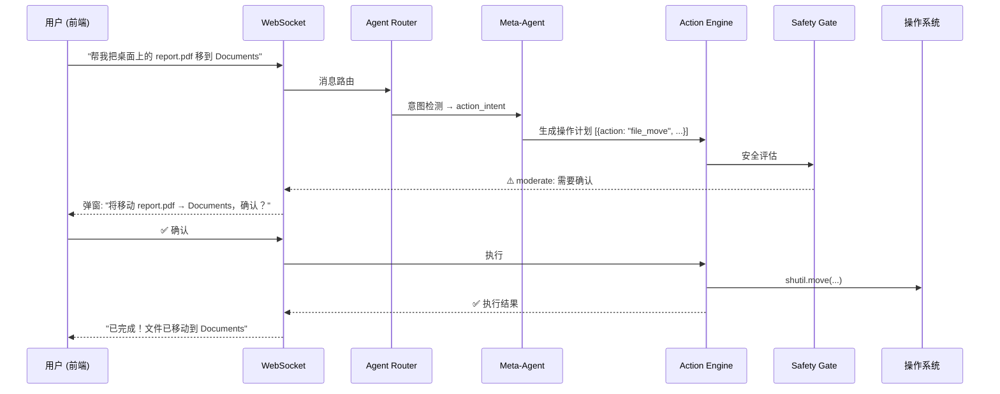

# OS 级计算机控制架构 — Action Agent

## 架构总览



---

## 模块 1：本地执行桥接 (Local Execution Bridge)

### 为什么不需要 Electron/Tauri

我们的 FastAPI 后端**已经运行在本地操作系统上**，天然拥有 OS 权限。不需要额外框架：

```
浏览器 (前端 JS)
    ↕ WebSocket (ws://localhost:8000/ws)
FastAPI 后端 (Python, 本地进程)
    ↕ subprocess / os / pyautogui
操作系统 (Windows/macOS/Linux)
```

> [!IMPORTANT]
> **关键洞察**：浏览器沙盒限制的是前端 JS，但我们的指令是通过 WebSocket 发到本地 Python 后端执行的。Python 进程拥有完整的 OS 权限，无需"穿透"沙盒。

### WebSocket 通信协议

```json
// 客户端 → 服务端（请求执行）
{
  "type": "action_request",
  "id": "req_001",
  "actions": [
    {"tool": "shell_exec", "params": {"command": "dir D:\\Documents"}}
  ]
}

// 服务端 → 客户端（需要确认）
{
  "type": "action_confirm",
  "id": "req_001",
  "danger_level": "moderate",
  "description": "执行命令: dir D:\\Documents",
  "details": "读取 D:\\Documents 目录内容"
}

// 客户端 → 服务端（用户确认）
{
  "type": "action_approve",
  "id": "req_001",
  "approved": true
}

// 服务端 → 客户端（执行结果）
{
  "type": "action_result",
  "id": "req_001",
  "success": true,
  "output": "...",
  "duration_ms": 120
}
```

---

## 模块 2：工具调用体系 (Tool Schema)

### 2.1 Shell 执行器

```json
{
  "tool": "shell_exec",
  "params": {
    "command": "git status",
    "cwd": "D:/projects/myapp",
    "timeout": 30
  }
}
```

### 2.2 文件系统操作器

```json
{
  "tool": "file_op",
  "params": {
    "action": "move",        // read/write/copy/move/delete/list/mkdir
    "source": "D:/Desktop/report.pdf",
    "destination": "D:/Documents/report.pdf"
  }
}
```

### 2.3 GUI 自动化工具

```json
{
  "tool": "gui_action",
  "params": {
    "action": "click",       // click/type/hotkey/screenshot/find_text
    "x": 500, "y": 300,     // 坐标（click 用）
    "text": "Hello",         // 文本（type 用）
    "keys": ["ctrl", "s"]   // 按键（hotkey 用）
  }
}
```

### 2.4 截屏 + OCR 反馈

```json
{
  "tool": "screen_capture",
  "params": {
    "region": [0, 0, 1920, 1080],  // 可选区域
    "ocr": true                      // 是否 OCR 识别文本
  }
}
```

### 工具注册表

| 工具 | 危险等级 | 说明 |
|---|---|---|
| `shell_exec` | **critical** | 执行任意命令 |
| `file_op.read` | safe | 读文件 |
| `file_op.list` | safe | 列目录 |
| `file_op.write` | moderate | 写文件 |
| `file_op.copy` | moderate | 复制 |
| `file_op.move` | moderate | 移动 |
| `file_op.delete` | **critical** | 删除 |
| `file_op.mkdir` | safe | 创建目录 |
| `gui_action.screenshot` | safe | 截屏 |
| `gui_action.click` | moderate | 鼠标点击 |
| `gui_action.type` | moderate | 键盘输入 |
| `gui_action.hotkey` | moderate | 快捷键 |

---

## 模块 3：HITL 安全拦截机制

### 三级危险分类

```
┌─────────────────────────────────────────────┐
│  SAFE        → 自动执行，结果通知           │
│  file.read, file.list, screenshot, mkdir     │
├─────────────────────────────────────────────┤
│  MODERATE    → 前端弹窗确认后执行           │
│  file.write, file.move, click, type, hotkey  │
├─────────────────────────────────────────────┤
│  CRITICAL    → 红色警告 + 详细说明 + 确认   │
│  shell_exec, file.delete, 系统目录操作       │
│  包含 rm/del/format/shutdown 等关键词        │
└─────────────────────────────────────────────┘
```

### 沙盒目录限制

```python
SANDBOX_ROOTS = [
    os.getcwd(),              # 项目目录
    "D:/Documents",      # 文档
    "D:/Desktop",        # 桌面
    os.path.expanduser("~/Downloads"),
]

FORBIDDEN_PATHS = [
    "C:/Windows",
    "C:/Program Files",
    "/etc", "/usr", "/bin",
    os.path.expanduser("~/.ssh"),
]
```

### 命令黑名单

```python
DANGEROUS_COMMANDS = [
    r"\brm\b.*-rf",
    r"\bformat\b",
    r"\bdel\b.*\/[sS]",
    r"\bshutdown\b",
    r"\bregedit\b",
    r"\breg\b.*delete",
    r"\bnet\b.*user",
    r"\btaskkill\b.*\/f",
]
```

### 前端确认弹窗交互

```
┌─────────────────────────────────┐
│  ⚠️ 操作需要确认                │
│                                 │
│  操作: 移动文件                  │
│  源:   D:\Desktop\report.pdf    │
│  目标: D:\Documents\report.pdf  │
│                                 │
│  危险等级: MODERATE 🟡           │
│                                 │
│  [✅ 确认执行]  [❌ 取消]        │
└─────────────────────────────────┘
```

---

## 实施文件清单

### 后端

#### [NEW] `app/action_engine.py`
核心执行引擎：
- `ActionRequest` / `ActionResult` 数据模型
- `ShellExecutor` — subprocess 封装
- `FileOperator` — 文件系统操作
- `GUIController` — pyautogui 封装
- `ScreenCapture` — 截屏 + OCR
- `SafetyGate` — 安全拦截器（危险分级 + 沙盒 + 黑名单）

#### [NEW] `app/action_planner.py`
操作规划器（LLM → 操作计划）：
- `ACTION_PLANNER_PROMPT` — 规划器系统提示词
- `plan_actions()` — 自然语言 → 操作序列
- `detect_action_intent()` — 判断是否需要操作电脑

#### [MODIFY] `app/agent_router.py`
- 路由新增：配置进化 > **操作执行** > 工具调用 > 普通聊天

#### [MODIFY] `app/main.py`
- 新增 WebSocket 端点 `ws://localhost:8000/ws`
- 新增 `GET /api/actions/history` — 操作日志

### 前端

#### [MODIFY] `frontend/app.js`
- WebSocket 连接管理
- 确认弹窗组件
- 操作进度/结果渲染

#### [MODIFY] `frontend/index.html`
- 确认弹窗 DOM

#### [MODIFY] `frontend/style.css`
- 弹窗样式 + 危险等级颜色

### 依赖

#### [MODIFY] `requirements.txt`
- `pyautogui` — GUI 自动化
- `Pillow` — 截屏
- `websockets` — WS（FastAPI 自带）

---

## Open Questions

> [!IMPORTANT]
> **OCR 方案选择**：
> - 方案 A: `pytesseract`（需安装 Tesseract 外部程序，中文识别好）
> - 方案 B: Windows 原生 OCR API（`winocr`，无需额外安装）
> - 方案 C: 暂不实现 OCR，先用截屏图片 + 多模态模型识别
> 
> **建议用方案 C**，因为我们有本地 LLM 可以看图。需要确认。

> [!WARNING]
> **GUI 自动化需注意**：`pyautogui` 在 Windows 上需要以非服务模式运行（有桌面会话）。我们当前从终端启动 Python，这没问题。

## Verification Plan

### 自动化测试
1. WebSocket 连接 → 发送 safe 操作 → 自动执行 → 返回结果
2. 发送 moderate 操作 → 返回确认请求 → 模拟确认 → 执行
3. 发送 critical 操作 → 返回红色警告 → 测试拒绝
4. 测试沙盒越界 → 应被拦截
5. 测试黑名单命令 → 应被拒绝

### 集成测试
- 聊天中说 "帮我看看桌面有什么文件" → 自动 list 桌面目录
- 说 "把桌面的 test.txt 移到文档" → 弹窗确认 → 执行
- 说 "执行 rm -rf /" → 被黑名单拦截
