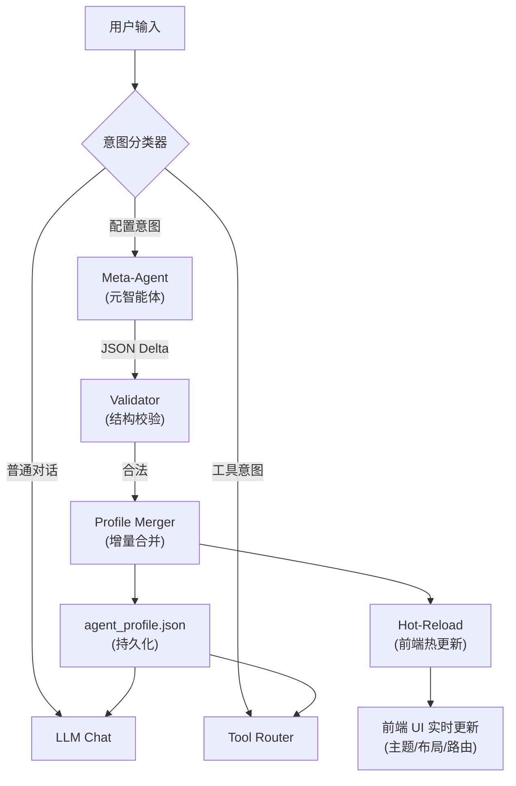

# 自我进化智能体架构 — 技术实施方案

## 架构总览



**核心思路**：用户的配置意图不再走简单的关键词匹配，而是由一个专门的 **Meta-Agent** 解析自然语言，输出结构化的 JSON 增量（Delta），然后通过 **Profile Merger** 合并到当前配置，触发前后端热更新。

---

## 模块 1：Agent Profile 数据字典

这是整个系统的状态核心，所有可进化维度都在这一个 JSON 里：

```json
{
  "version": "2.0",
  "identity": {
    "name": "LocalMindDesk",
    "icon": "🧠",
    "role": "通用 AI 助手",
    "description": "高效的本地 AI 助手",
    "personality_traits": ["professional", "concise", "helpful"],
    "system_prompt": "你是 LocalMindDesk..."
  },
  "model_routing": {
    "default_model": "local-lmstudio",
    "task_rules": [
      {
        "task_type": "coding",
        "preferred_model": "deepseek-coder",
        "temperature": 0.2,
        "max_tokens": 8192,
        "priority": 1
      },
      {
        "task_type": "creative_writing",
        "preferred_model": "local-lmstudio",
        "temperature": 0.9,
        "max_tokens": 4096,
        "priority": 2
      },
      {
        "task_type": "analysis",
        "preferred_model": "deepseek-chat",
        "temperature": 0.3,
        "max_tokens": 4096,
        "priority": 3
      }
    ],
    "fallback_chain": ["local-lmstudio"],
    "auto_route": true
  },
  "ui_preferences": {
    "theme": "dark",
    "accent_hue": 220,
    "accent_color": "#3b82f6",
    "font_size": 14,
    "font_family": "Inter",
    "layout": "standard",
    "code_theme": "github-dark-dimmed",
    "message_style": "bubble",
    "sidebar_visible": true
  },
  "behavior": {
    "response_style": "balanced",
    "response_length": "medium",
    "language": "zh-CN",
    "auto_search": false,
    "auto_memo": false,
    "proactive_suggestions": true,
    "max_context_messages": 20,
    "greeting": "你好！有什么可以帮你的？"
  },
  "evolution_log": [
    {
      "timestamp": "2026-04-30T14:00:00",
      "trigger": "你是监督我学习的",
      "changes_summary": "切换为学习监督员角色",
      "delta_applied": { "identity.name": "学习监督员" }
    }
  ],
  "updated_at": "2026-04-30T14:00:00"
}
```

### 关键设计决策

| 维度 | 字段 | 可进化 | 说明 |
|---|---|---|---|
| 身份 | `identity.*` | ✅ | 名称/角色/系统提示/性格特质 |
| 模型路由 | `model_routing.*` | ✅ | 默认模型/任务偏好/温度/降级链 |
| UI 外观 | `ui_preferences.*` | ✅ | 主题/色调/字号/布局 |
| 行为模式 | `behavior.*` | ✅ | 回答风格/长度/语言/自动功能 |
| 进化日志 | `evolution_log` | 追加 | 所有变更历史（可回滚） |

---

## 模块 2：Meta-Agent 提示词工程

> [!IMPORTANT]
> Meta-Agent 是系统灵魂。它接收用户的自然语言配置需求，输出严格的 JSON Delta。

核心 System Prompt 设计见 `app/meta_agent.py` 实现。

---

## 模块 3：自我更新闭环工作流

```
1. 用户输入 "回答更简短，默认用最强模型，界面极客风"
         ↓
2. 意图分类器识别为【配置意图】（关键词 + LLM 双重判断）
         ↓
3. Meta-Agent 解析，输出 JSON Delta：
   {
     "behavior.response_length": "short",
     "model_routing.default_model": "deepseek-chat",
     "ui_preferences.theme": "hacker",
     "ui_preferences.accent_hue": 120
   }
         ↓
4. Validator 校验 Delta 合法性（字段存在、类型正确）
         ↓
5. Profile Merger 深度合并到 agent_profile.json
         ↓
6. 后端立即生效（下次请求用新 system_prompt / 新路由规则）
         ↓
7. 前端收到 persona_changed 事件 → 热更新 CSS 变量 + UI 状态
         ↓
8. 追加 evolution_log（支持未来回滚）
```

---

## 模块 4：实施文件清单

### 后端

#### [NEW] `app/agent_profile.py`
- `AgentProfile` Pydantic 模型（完整数据字典）
- `load_profile()` / `save_profile()` — 持久化
- `merge_delta()` — 增量合并（支持 dot-path，如 `identity.name`）
- `validate_delta()` — 合法性校验
- `get_routing_for_task()` — 根据任务类型返回模型偏好

#### [NEW] `app/meta_agent.py`
- `META_SYSTEM_PROMPT` — 元智能体核心提示词
- `detect_config_intent()` — 配置意图检测
- `parse_config_request()` — 调 LLM 解析，返回 JSON Delta
- `apply_evolution()` — 端到端执行：解析 → 校验 → 合并 → 保存

#### [MODIFY] `app/agent_router.py`
- 路由函数使用 `agent_profile` 的 `model_routing` 做任务级模型选择
- 人格切换逻辑替换为 `meta_agent.apply_evolution()`

#### [MODIFY] `app/main.py`
- 新增 `GET /api/profile` — 获取完整 Profile
- 新增 `POST /api/profile/evolve` — 手动提交配置请求
- `/api/chat` 返回中包含 `profile_update` 事件

### 前端

#### [MODIFY] `frontend/app.js`
- 收到 `profile_update` → 动态应用 CSS 变量（主题/色调/字号）
- 加载时从 `/api/profile` 获取 UI 偏好

#### [MODIFY] `frontend/style.css`
- 所有硬编码颜色改为 CSS 变量（已经是），新增 hue-rotate 支持

#### [DELETE] `app/persona.py`
- 功能已被 `agent_profile.py` + `meta_agent.py` 完全替代

---

## Verification Plan

### 自动化验证
1. 启动服务，`GET /api/profile` 返回完整 Profile
2. 发送 "回答更简短" → 验证 `behavior.response_length` 变更
3. 发送 "默认用 deepseek" → 验证 `model_routing.default_model` 变更
4. 发送 "界面换成绿色" → 验证前端 accent 颜色热更新
5. 发送 "你是首席科学家" → 验证 identity 全量切换
6. `GET /api/profile` 检查 evolution_log 追加

### 手动验证
- 浏览器打开 http://localhost:8000 验证 UI 热更新效果
